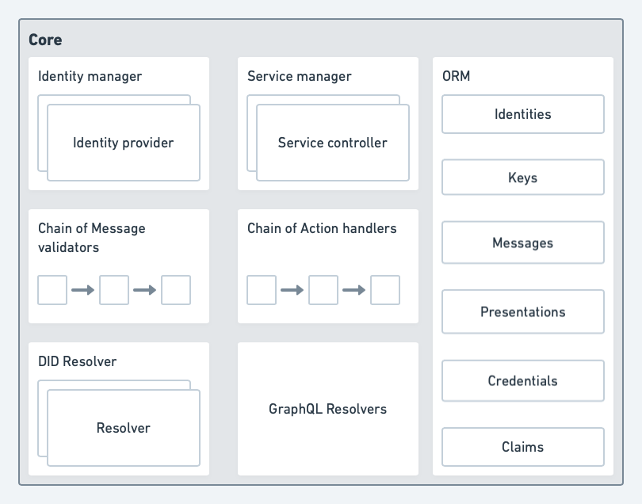

# DID Agent Framework

## Architecture



## Getting started

DAF monorepo uses yarn workspaces & lerna

Install root package dependencies

```
yarn install
```

Install all packages dependencies

```
yarn bootstrap
```

Build

```
yarn build
```

Run the tests

```
yarn test
```

```
yarn test:watch
```

## DAF cli tool

Use the local development version

```
yarn daf <command> <options>
```

Use the released version [daf-cli](packages/daf-cli)

Create identity

```
npx daf identity-manager --create
```

Create and send Verifiable Credential

```
npx daf credential --create --send
```

Receive new messages

```
npx daf listen
```

Start GraphQL server

```
npx daf graphql --port 8899
```

More

```
npx daf --help
```
