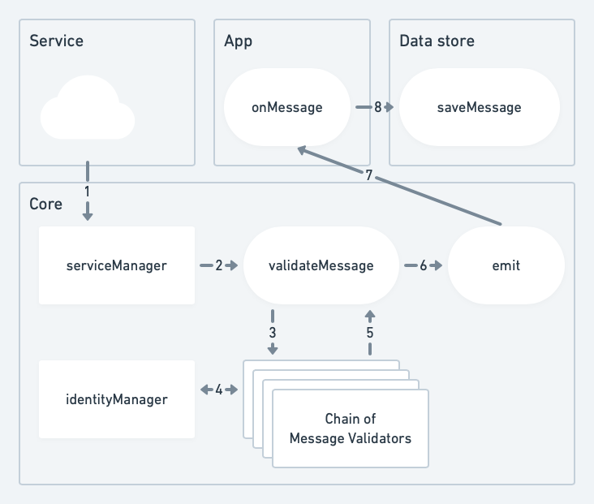
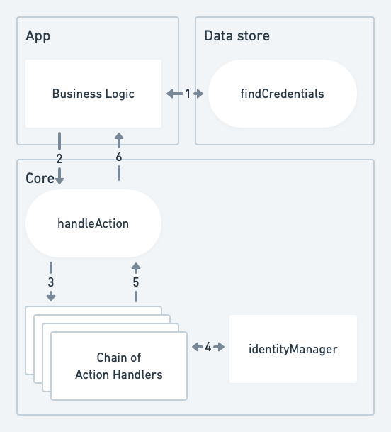
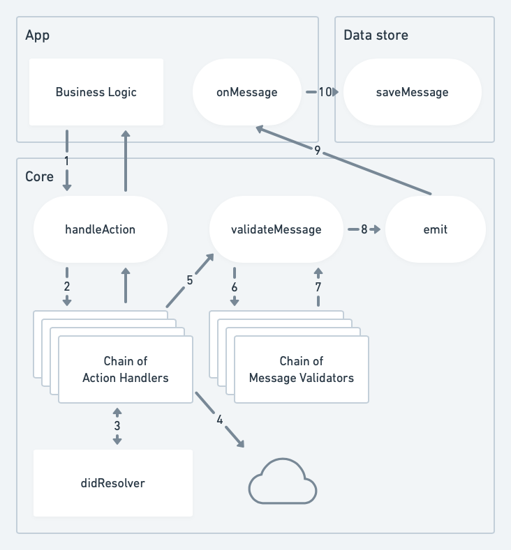

# Data Flow Diagrams

## New message from QR Code

1. Raw Message
2. Raw Message
3. Message
4. Message
5. Message
6. Message (if save == true)
7. Message (if save == true)
8. Message (if save == true)
9. Message

## New message from external service

1. Encrypted raw message
2. Raw Message
3. Raw Message
4. Getting encryption key. Decrypting
5. Message
6. Message
7. Message
8. Message (if save == true)
9. Message (if save == true)
10. Message (if save == true)

## Signing Verifiable Presentation

1. Getting Credentials in JWT format
2. Action `sign.w3c.vp.jwt` + data
3. Action `sign.w3c.vp.jwt` + data
4. Getting signing key. Signing
5. Presentation
6. Presentation (if save == true)
7. Presentation

## Sending Verifiable Presentation

1. Action `send.message.didcomm-alpha-1` + JWM with Verifiable Presentation in JWT format as body
2. Action `send.message.didcomm-alpha-1` + JWM with Verifiable Presentation in JWT format as body
3. Resolving recipient DID Document
4. Encrypting message if encryption key is published in DID Document. POSTing message to `Messaging` service endpoint
5. Raw message
6. Raw message
7. Message
8. Message
9. Message
10. Message (if save == true)
11. Message (if save == true)
12. Message (if save == true)
13. Message
14. Message
